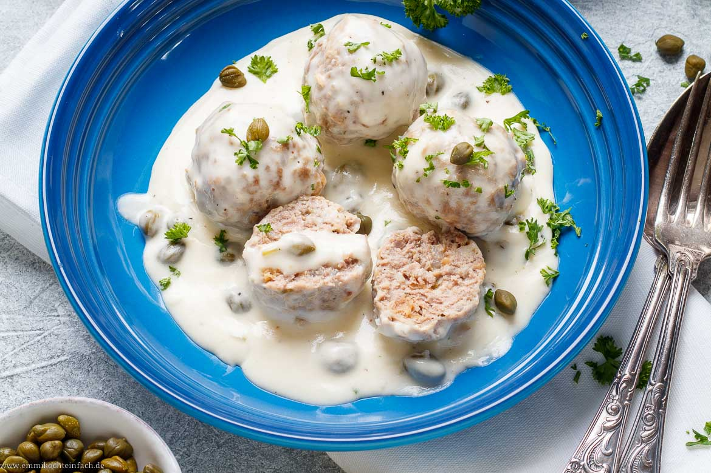

# Königesberger Klöpse
[[Basic Ingriedients]]

>==_Allein zu essen (solipsismus convictorii) ist für einen philosophierenden Gelehrten ungesund; nicht Restauration, sondern (vornehmlich wenn es gar einsames Schwelgen wird) Exhaustion; erschöpfende Arbeit, nicht belebendes Spiel der Gedanken. Der genießende Mensch, der im Denken während der einsamen Mahlzeiten an sich selbst zehrt, verliert allmählich die Munterkeit, die er dagegen gewinnt, wenn ein Tischgenosse ihm durch seine abwechselnde Einfälle neuen Stoff zur Belehrung darbietet; welchen er selbst nicht hat ausspüren dürfen.  

**_(Immanuel Kant (1724 – 1804, Königsberg, In: Anthropologie in pragmatischer Hinsicht, erstes Buch, § 59, A 248/B 247)

---

---
### What you need for 4 Persons?
---
1.  [x]  500g Meat (Beef is the best)
2.  [ ]  3 Eggs
3.  [ ] 125 g Breadcramps
4.  [x] A small can of pickeled Carpern 
5.  [ ]  1 Onions
6.  [ ] 2-3 Sardinnes 
---
6.  [ ] ==200ml Creme==
7.  [ ] 125g Butter
8.  [ ] 2 Carottes
9.  [ ]  2 leafs of laurel
10.  [ ] 1 Citrone
11.  [ ] 2 Onions
12.  [ ] 50g flowers
13.  [ ] Salt & Papper
14.  [ ] 250g Rice or 350g Potatos
15.  [ ] 200g Champions
17.  [ ] Brown Sugar
18.  [ ] Nutmeg
---
-  [x] Do you have everything?
-  [x] Are you ready?

---

### How to do it?

- First: Cut the onions in small chuncks mix it with the meet, the eggs and the breadcramps, knead it, put a little bit salt and papper in it. If you like you can put also half of the carpers in it.
- Now make the broth: You need 2.5l of hot water, the laurel, salt, papper, and the two carrotts, cut them first in small pieces.
- Now make small meetballs put it in the hot water, it should not boil they need around 10 min
--- 

### The Sauce

- Put the butter in a small cooking pot, heat it, but do not use so much heat
- Now put the flower in it, just for 2-3 three minutes
- Reduce the heat of your oven
- Now take a little bit of broth, were you boiled the meetballs, use the whisk, so that you do not have any clumps
- take the juice of the citron and put it into the sauce
- Now put the cream into it
- Season the sauce with salt and Paper, if you like a little bit nutmeg
- Put a spoon of brown sugar in it
- Additional: cut the champions, and put it into the sauce 

[[Lasagne]]

